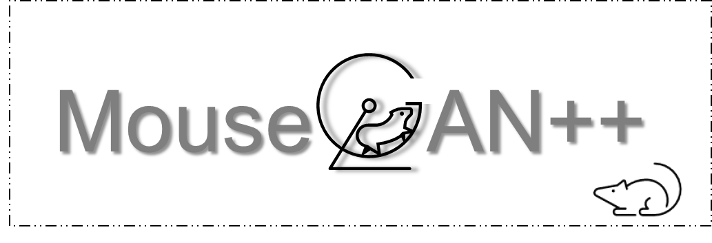

<div>

	<h1> MouseGAN++ </h1>
<blockquote> Unsupervised Disentanglement and Contrastive Representation for Multiple MRI Modalities Synthesis and Structural Segmentation of Mouse Brain
</blockquote>
</div>
<br />

<hr />


### [Paper](todo) | [Pipeline](todo)  | [Replicate demo](#replicate-demo) | [MRI data release](#dataset_release) | [Pretrained weight](/dataset_release) | [Interface](todo)  | [Documentation](todo)  | [Contents](#Quick-Start-Contents) | [See also: BEN]()

See also: 
```
BEN: A generalized Brain Extraction Net for multimodal MRI data from rodents, nonhuman primates, and humans
```
[Github project link](https://github.com/yu02019/BEN)


[//]: # (## Overview)

[//]: # (🚀 Quick start to use BEN or replicate our experiments in 5 minutes!)

### Replicate Demo and Results


| Name       | Description         | Colab link |
|------------|---------------------|------------|
| MouseGAN++ | MouseGAN++ pipeline | Todo       |


### Replicate Demo and Results
 

| Name                      | Description                                                          | Snapshot                                                                                                  | Colab link                                                                                                                                                                                                                                                                                                                                                                       |
|---------------------------|----------------------------------------------------------------------|-----------------------------------------------------------------------------------------------------------|----------------------------------------------------------------------------------------------------------------------------------------------------------------------------------------------------------------------------------------------------------------------------------------------------------------------------------------------------------------------------------|
| MRM NeAt segmentation     | Segmentation results & pretrained weights.                           |
| Ablation study loss curve | Loss curve for ablation study from Tensorboard.                      |  | Cross species [](https://colab.research.google.com/drive/1qsBg-_6NxVFUJCk0tbTyQ7vY8_FLnrc9?usp=sharing)                                                                                                                                                                                                |
| Pretrained weight         | Pretrained weight for MouseGAN++.                                    |         | Cross modalities [](https://colab.research.google.com/drive/14NWqdbkpsdt0cS4-SLCvcDmHLU05UlmV?usp=sharing) <br/> Cross MR scanners [](https://colab.research.google.com/drive/1xrREREKEs0HvDvhxA0sGCLsIdAFNLd2w?usp=sharing) |
| More examples             | More results of MouseGAN++ and sota methods, including failure case. |                | [](https://colab.research.google.com/drive/1HgHgqli-mVuIj9QolJ85KEB8LJcgN5qh?usp=sharing)                                                                                                                                                                                                              |

 


### MRI data release | pretrained weight

The details can be found in this [folder](/dataset_release).


---
## Quick Start Contents

Visit our [documentation](todo) for installation, tutorials and more.

* [Installation](#installation)
* [Quick Start / Tutorial](#quick-start)
    + [Run pipeline](#run-pipeline)
    + [Run translation alone](#run-translation-alone)
    + [Run segmentation alone](#run-segmentation-alone)  
    + [Choice of pretext task](#choice-of-pretext-task)
* [Resources](#resources)
  * [Dataset release](/dataset_release)
  * [Pretained weight](/dataset_release)


## Installation

[//]: # (An Nvidia GPU is needed for faster inference &#40;less than 1 sec/scan on 1080ti gpu&#41;.)

Requirements:

* torch == 1.15.4
* numpy == 1.16
* SimpleITK == 2.0
* opencv-python == 4.1

[//]: # (* scikit-image == 0.16.2)


Install dependencies:


```shell
git clone https://github.com/yu02019/MouseGAN-pp.git
cd MouseGAN-pp
pip install -r requirement.txt
```

The target domain data folder looks like this: (Download data from this repository/Colab or put your data here.)


## Quick Start

### Cross modalities

#### Results:

1. Modality: T2WI -> EPI
2. For this exemplar domain adaptation (DA) task, No label is used (zero-shot).
3. From top raw to the third raw: Raw image, Baseline result, BEN's result.

   

### Cross MR scanner with different field strengths

1. MR scanner with different field strengths: 11.7 T -> 7 T
2. For this exemplar domain adaptation (DA) task, No label is used (zero-shot).
3. From top raw to the third raw: Raw image, Baseline result, BEN's result.

   

### Cross species

1. Species: Mouse -> Rat
2. For this exemplar domain adaptation (DA) task, only ONE label is used.
3. The segmentation results are shown in red, the ground truth are shown in orange.
4. From top raw to the fifth raw: Raw image, Zero-shot (0 label used), finetune (1 label used), BEN's result (1 label
   used), Ground truth.

   

5. (Optional) Just do some simple postprocessing here, e.g., only save the top-K largest connected regions.
6. Compared with other methods, it further shows BEN's advantages

   

## Choice of pretext task

In our paper, we used modality translation as our pretext task, as we wanted to impute missing modality. However, if readers are faced with multi-center single modality data (e.g, T2w MR images from 11.7T and 9.4T scanners), our pretext task could change to center-style translation easily.


# Resources


## Data release / Pretrained weight / Contributing to BEN

[//]: # (The details can be found in this [folder]&#40;/dataset_release&#41;.)

We will release Multi-Modality Dataset


---


# Citation
If you find our work / datasets useful for your research, please consider citing:

```bibtex
@article{yu2022ben,
  title={BEN: a generalizable Brain Extraction Net for multimodal MRI data from rodents, nonhuman primates, and humans},
  author={Yu, Ziqi and Han, Xiaoyang and Xu, Wenjing and Zhang, Jie and Marr, Carsten and Shen, Dinggang and Peng, Tingying and Zhang, Xiao-Yong and Feng, Jianfeng},
  journal={bioRxiv},
  year={2022},
  publisher={Cold Spring Harbor Laboratory}
}
```

[//]: # (dataset reference: todo)


[//]: # (Acknowledgements: TODO)

Disclaimer: This toolkit is only for research purpose. If used on an additional dataset, the model might need to be fine-tuned before running.

