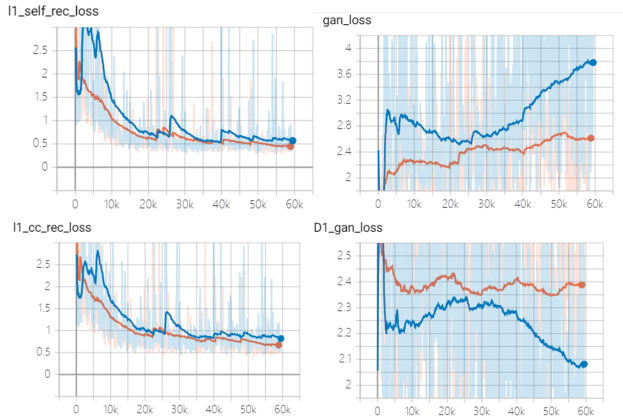

# Replicate Demo and Results

## Contents

Visit our [documentation](todo) for installation, tutorials and more.

* [MRM NeAt segmentation](#MRM-NeAt-segmentation)
* [Ablation study loss curve](#ablation-study-loss-curve)
* [Pretrained weight](#pretrained-weight)

* [More examples](#more-examples)
* [Rater study](#rater-study)


## MRM NeAt segmentation
We use 5-fold, 100 epochs, augmentation including resize, shift, scale and rotate for all methods. Details can be found in our paper.

The raw data file and other metrics (e.g., ASD) can be found in [Excel table](./results-ep100.xlsx).

| Fold (Dice)                      | Hipp            | SC              | stri (checked)  | Tha             | Weight file                                                          |
|----------------------------------|-----------------|-----------------|-----------------|-----------------|----------------------------------------------------------------------|
| Fold 1                           | 0.9033 ± 0.0143 | 0.8765 ± 0.0215 | 0.9179 ± 0.0108 | 0.9276 ± 0.0087 | [Link](https://pan.baidu.com/s/175BXR675dQSyhFX14bk5zg) (Code: l4oh) |
| Fold 2                           | 0.9078 ± 0.0139 | 0.8646 ± 0.0190 | 0.9142 ± 0.0143 | 0.9259 ± 0.0055 | [Link](https://pan.baidu.com/s/175BXR675dQSyhFX14bk5zg) (Code: l4oh) |
| Fold 3                           | 0.9084 ± 0.0157 | 0.8741 ± 0.0271 | 0.9175 ± 0.0036 | 0.9327 ± 0.0104 | [Link](https://pan.baidu.com/s/175BXR675dQSyhFX14bk5zg) (Code: l4oh) |
| Fold 4                           | 0.9068 ± 0.0200 | 0.8710 ± 0.0404 | 0.9167 ± 0.0126 | 0.9237 ± 0.0089 | [Link](https://pan.baidu.com/s/175BXR675dQSyhFX14bk5zg) (Code: l4oh) |
| Fold 5                           | 0.9046 ± 0.0167 | 0.8712 ± 0.0260 | 0.9205 ± 0.0105 | 0.9295 ± 0.0049 | [Link](https://pan.baidu.com/s/175BXR675dQSyhFX14bk5zg) (Code: l4oh) |
| Avg<br/>(presented in the paper) | 0.9062 ± 0.0146 | 0.8715 ± 0.0250 | 0.9174 ± 0.0100 | 0.9279 ± 0.0077 | -                                                                    |


## Ablation study loss curve
We provide tensorboard log files for ablation study experiments. [link](https://pan.baidu.com/s/1JPIOOdihim1FSgY4ElBt7w) (Code: 5ygr).

('L_kl' term represents L2 regularization in both MouseGAN and MouseGAN++, actually.) 

How to display:
```shell
tensorboard --logdir=run1:MouseGAN++,run2:MouseGAN --host localhost  --port=6060
# open in the browser: http://localhost:6060/#scalars&_smoothingWeight=0.985
```



## Pretrained weight
todo


## More examples
todo


## Rater study 
todo
