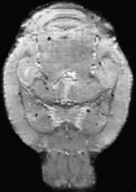

# Replicate Demo and Results

---

## Contents


Visit our [documentation](todo) for installation, tutorials and more.

* [MRM NeAt segmentation](#MRM-NeAt-segmentation)
* [Ablation study loss curve](#ablation-study-loss-curve)
* [Pretrained weight](#pretrained-weight)
* [More examples](#more-examples)
* [Rater study](#rater-study)
* [Dataset release](#dataset-release)
* [Contributing to MouseGAN++](#Contributing-to-MouseGAN++)
* [Hyper-parameter](#hyper-parameter)
* [Limitation](#Limitation)

[//]: # (* [Acknowledgement]&#40;#Acknowledgement&#41;)
[//]: # (todo: Acknowledgement)

---

## MRM NeAt segmentation
We use 5-fold, 100 epochs, augmentation including resize, shift, scale and rotate for all methods. Details can be found in our paper.

The raw data file and other metrics (e.g., ASD) can be found in [Excel table](./results-ep100.xlsx).

| Fold (Dice)                      | Hipp            | SC              | Striatum        | Tha             | Weight file                                                          |
|----------------------------------|-----------------|-----------------|-----------------|-----------------|----------------------------------------------------------------------|
| Fold 1                           | 0.9033 ± 0.0143 | 0.8765 ± 0.0215 | 0.9179 ± 0.0108 | 0.9276 ± 0.0087 | [Link](https://pan.baidu.com/s/175BXR675dQSyhFX14bk5zg) (Code: l4oh) |
| Fold 2                           | 0.9078 ± 0.0139 | 0.8646 ± 0.0190 | 0.9142 ± 0.0143 | 0.9259 ± 0.0055 | [Link](https://pan.baidu.com/s/175BXR675dQSyhFX14bk5zg) (Code: l4oh) |
| Fold 3                           | 0.9084 ± 0.0157 | 0.8741 ± 0.0271 | 0.9175 ± 0.0036 | 0.9327 ± 0.0104 | [Link](https://pan.baidu.com/s/175BXR675dQSyhFX14bk5zg) (Code: l4oh) |
| Fold 4                           | 0.9068 ± 0.0200 | 0.8710 ± 0.0404 | 0.9167 ± 0.0126 | 0.9237 ± 0.0089 | [Link](https://pan.baidu.com/s/175BXR675dQSyhFX14bk5zg) (Code: l4oh) |
| Fold 5                           | 0.9046 ± 0.0167 | 0.8712 ± 0.0260 | 0.9205 ± 0.0105 | 0.9295 ± 0.0049 | [Link](https://pan.baidu.com/s/175BXR675dQSyhFX14bk5zg) (Code: l4oh) |
| Avg<br/>(presented in the paper) | 0.9062 ± 0.0146 | 0.8715 ± 0.0250 | 0.9174 ± 0.0100 | 0.9279 ± 0.0077 | -                                                                    |


## Ablation study loss curve
We provide tensorboard log files for ablation study experiments. [link](https://pan.baidu.com/s/1JPIOOdihim1FSgY4ElBt7w) (Code: 5ygr).

('L_kl' term represents L2 regularization in both MouseGAN and MouseGAN++, actually.) 

How to display:
```shell
tensorboard --logdir=run1:MouseGAN++,run2:MouseGAN --host localhost  --port=6060
# open in the browser: http://localhost:6060/#scalars&_smoothingWeight=0.985
```


## Pretrained weight


| Method     | Dataset                | Weight file                                                          |
|------------|------------------------|----------------------------------------------------------------------|
| MouseGAN++ | Multi-Modality Dataset | [Link](https://pan.baidu.com/s/14ivPaMRZ2Wx_jjs_TSnsRQ) (Code: ummb) |
| MouseGAN   | Multi-Modality Dataset | [Link](https://pan.baidu.com/s/14ivPaMRZ2Wx_jjs_TSnsRQ) (Code: ummb) |
| StarGAN-v2 | Multi-Modality Dataset | [Link](https://pan.baidu.com/s/14ivPaMRZ2Wx_jjs_TSnsRQ) (Code: ummb) |


Segmentation module:


| Method     | Dataset                                 | Weight file                                                          |
|------------|-----------------------------------------|----------------------------------------------------------------------|
| MouseGAN++ | Multi-Modality Dataset (finetune on T1) | [Link](https://pan.baidu.com/s/14ivPaMRZ2Wx_jjs_TSnsRQ) (Code: ummb) |
| MouseGAN++ | Multi-Modality Dataset (finetune on T2) | [Link](https://pan.baidu.com/s/14ivPaMRZ2Wx_jjs_TSnsRQ) (Code: ummb) |
| MouseGAN++ | MRM NeAt Dataset                        | [Link](https://pan.baidu.com/s/175BXR675dQSyhFX14bk5zg) (Code: l4oh) |


## More examples

Some failed cases:

| Methods    | Input image                    | Real image                    | Synthetic image                        | Modality   |
|------------|--------------------------------|-------------------------------|----------------------------------------|------------|
| MouseGAN++ |  |  |         | T1w -> T2w |
| MouseGAN++ |  |  |         | T1w -> T2w |
| StarGAN-v2 |   |   |  | T1w -> T2w |
| StarGAN-v2 |   |   |  | T1w -> T2w |

More cases:

| Methods    | Synthetic image                        | Modality       |
|------------|----------------------------------------|----------------|
| MouseGAN++ |             | T2*w -> Others |
| MouseGAN++ |             | T2w -> Others  |
| MouseGAN++ |             | T1w -> Others  |
| StarGAN-v2 |  | -              |


## Rater study 

We have invited three experts to score the synthetic images from 12 test mice with regard to the delineation of related anatomy on a 10-point scale as follows: excellent diagnostic quality (8-10), good diagnostic quality (6-8), fair diagnostic quality (4-6), poor diagnostic quality (2-4), and non-diagnostic (0-2). Please refer to the following table.


|                        | Real image (label) | MouseGAN++  | MouseGAN    | CycleGAN    | SynSeg      | UNIT        | MUNIT       | StarGAN-v2  |
|------------------------|--------------------|-------------|-------------|-------------|-------------|-------------|-------------|-------------|
| Score<br/>(mean ± std) | 9.13 ± 0.72        | 7.56 ± 0.84 | 7.25 ± 0.84 | 4.58 ± 1.23 | 4.67 ± 1.15 | 4.36 ± 1.13 | 4.47 ± 1.50 | 4.67 ± 1.45 |

## Dataset release
At the current stage, our dataset is provisionally available at https://pan.baidu.com/s/1CqukZN0ShIbRDtNWCHFr-w, and please send emails to Dr. Xiao-Yong Zhang at xiaoyong_zhang@fudan.edu.cn for the password.
(Datasets are still being collated and packaged, and will be released formally via Zenodo.org with the publication of the paper.)


## Contributing to MouseGAN++

We are happy about any contributions! (MRI data / trained weight / plug-in function code)

MouseGAN++ follows the open-access paradigm, allowing users to save their updated models and share their weights for use by the neuroimaging community.

Besides, the accumulation of additional imaging data will further improve the performance of MouseGAN++ and support the exploration of complex neuroimaging research.


## Hyper-parameter
To update.

[//]: # (todo: how to tune these hyper-parameters)


## Limitation
One limitation of our work is the dilemma caused by domain shifts, since the image quality and contrast from various centers may differ greatly. An appealing and promising solution is to convert our pretext task to cross-center image translation so that the learned center-agnostic features in the content space would alleviate the segmentation performance degradation.


