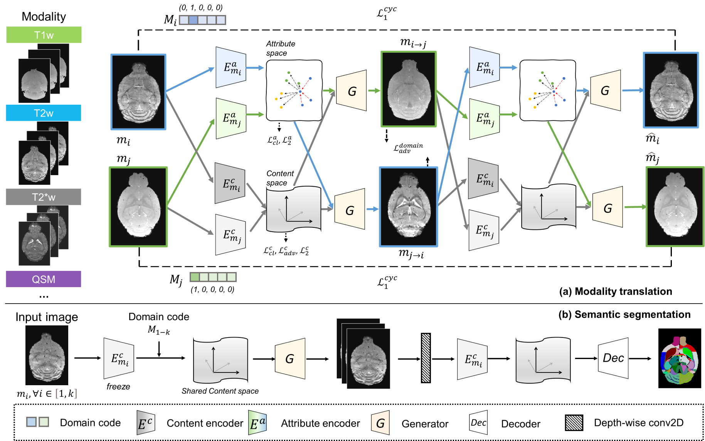

.. BEN documentation master file, created by
   sphinx-quickstart on Thu Jul 21 16:59:24 2022.
   You can adapt this file completely to your liking, but it should at least
   contain the root `toctree` directive.

|Docs|

MouseGAN++
===========

**MouseGAN++: Unsupervised Disentanglement and Contrastive Representation for Multiple MRI Modalities Synthesis and Structural Segmentation of Mouse Brain.**

:mod:`MouseGAN++`: Unsupervised DisentanglementSegmenting the fine structure of the mouse brain on magnetic resonance (MR)
images is critical for delineating morphological regions, analyzing brain function, and understanding
their relationships. Compared to a single MRI modality, multimodal MRI data provide complementary tissue features
that can be exploited by deep learning models, resulting in better segmentation results. However, multimodal mouse
brain MRI data is often lacking, making automatic segmentation of mouse brain fine structure a very challenging task.
To address this issue, it is theoretically necessary to fuse multimodal MRI data to produce distinguished contrasts in
different brain structures. Hence, we propose a novel disentangled and contrastive GAN-based framework,
named :mod:`MouseGAN++`, to synthesize multiple MR modalities from single ones in a structure-preserving manner,
thus improving the segmentation performance by imputing missing modalities and multi-modality fusion. Our results
demonstrate that the translation performance of our method outperforms the state-of-the-art methods. Using the
subsequently learned modality-invariant information as well as the modalitytranslated images, :mod:`MouseGAN++` can
segment fine brain structures with averaged dice coefficients of 90.0% (T2w) and 87.9% (T1w), respectively, achieving
around +10% performance improvement compared to the state-of-the-art algorithms. Our results demonstrate that
:mod:`MouseGAN++`, as a simultaneous image synthesis and segmentation method, can be used to fuse cross-modality information
in an unpaired manner and yield more robust performance in the absence of multimodal data. We release our method
as a pipeline at https://github.com/yu02019

.. Statement on updated algorith, GPU acceleration when available

Manuscript
----------

Under review.

Getting started with MouseGAN++
---------------------------------
Browse tutorials and usages.

Contributing to MouseGAN++
---------------------------

We are happy about any contributions! (MRI data / trained weight / plug-in function code)

MouseGAN++ follows the open-access paradigm, allowing users to save their updated models and share their weights for use by the neuroimaging community.

Besides, the accumulation of additional imaging data will further improve the performance of MouseGAN++ and support the exploration of complex neuroimaging research.

If you have any suggestions, feel free to contact our corresponding author.

.. toctree::
   :caption: General
   :maxdepth: 2
   :hidden:

   installation
   release_notes
..   contributors    .. todo update
..   contributing    .. todo update

.. toctree::
   :caption: Gallery and Resource
   :maxdepth: 2
   :hidden:

   tutorials

.. Indices and tables
.. ==================

.. * :ref:`genindex`
.. * :ref:`modindex`
.. * :ref:`search`

.. |Docs| image:: https://img.shields.io/readthedocs/ben-docs
    :target: https://ben-docs.readthedocs.io/en/latest/
    :alt: Documentation

